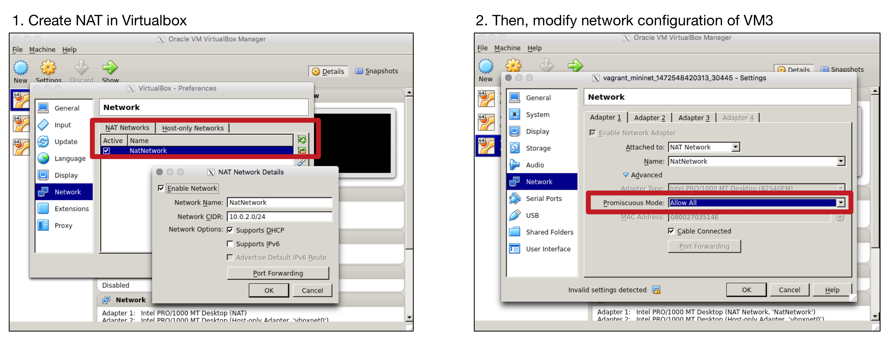
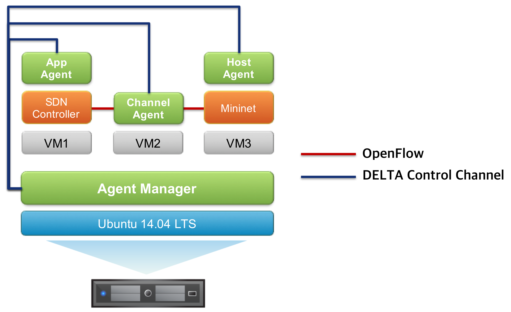
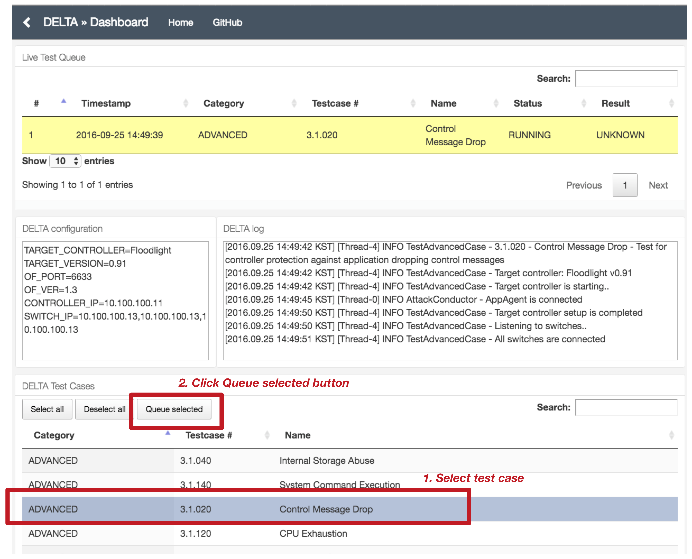

[](http://opensourcesdn.org/projects/project-delta-sdn-security-evaluation-framework/)
[](https://www.blackhat.com/us-17/arsenal/schedule/#delta-sdn-security-evaluation-framework-7466)

# DELTA: SDN SECURITY EVALUATION FRAMEWORK

## What is DELTA?
DELTA is a penetration testing framework that regenerates known attack scenarios for diverse test cases. This framework also provides the capability of discovering unknown security problems in SDN by employing a fuzzing technique.

+ Agent-Manager is the control tower. It takes full control over all the agents deployed to the target SDN network.
+ Application-Agent is a legitimate SDN application that conducts attack procedures and is controller-dependent. The known malicious functions are implemented as application-agent functions.
+ Channel-Agent is deployed between the controller and the OpenFlow-enabled switch. The agent sniffs and modifies the unencrypted control messages. It is controller-independent.
+ Host-Agent behaves as if it was a legitimate host participating in the target SDN network. The agent demonstrates an attack in which a host attempts to compromise the control plane.


## Prerequisites
In order to build and run DELTA, the following are required:
+ An agent manager based on Ubuntu 14.04 LTS 64 bit
  + Ant build system
  + Maven v3.3.9
  + Vagrant
  + JDK 1.7 and 1.8
+ Target Controller (for application agent)
  + [Floodlight](http://www.projectfloodlight.org/download/): 0.91, 1.2
  + [ONOS](https://wiki.onosproject.org/display/ONOS/Downloads): 1.1, 1.6, 1.9
  + [OpenDaylight](https://www.opendaylight.org/downloads): Helium-sr3, Carbon
+ [Cbench](https://floodlight.atlassian.net/wiki/display/floodlightcontroller/Cbench) (for channel agent)
+ [Mininet 2.1+](http://mininet.org/download/) (for host agent)
+ (in the case of All-In-One Single Machine) Three virtual machines based on Ubuntu 14.04 LTS 64 bit.
  + VM-1: Target controller + Application agent
  + VM-2: Channel agent
  + VM-3: Host agent

## Installing DELTA
DELTA installation depends on maven and ant build system. The mvn command is used to install the agent-manager and the agents. DELTA can support an All-In-One Single Machine environment via virtual machines as well as a real hardware SDN environment.

+ STEP 1. Get the source code of DELTA on the agent manager machine

```
$ git clone https://github.com/OpenNetworkingFoundation/DELTA.git
```

+ STEP 2. Install DELTA dependencies

```
$ cd <DELTA>/tools/dev/delta-setup/
$ ./delta-setup-devenv-ubuntu
```

+ STEP 3. Install DELTA using maven build

```
$ cd <DELTA>
$ source ./tools/dev/delta-setup/bash_profile
$ mvn clean install
```

+ STEP 4-a. (All-In-One Single Machine) Install three virtual machines using vagrant system

```
$ cd <DELTA>/tools/dev/delta-setup/
$ ./delta-setup-vms-ubuntu
$ cd vagrant/
$ vagrant up
```

+ STEP 4-b. (All-In-One Single Machine) Add NAT to VM3 (mininet)


+ In the case of all-in-one single machine, the test environment is automatically setup as below:



## Configuring your own experiments
+ Execute sudo without the password
```
$ sudo visudo
In the bottom of the file, type the follow:
username ALL=(ALL) NOPASSWD: ALL
```
+ Configure passwd-less ssh login for the agents

```
$ vi <DELTA>/tools/dev/delta-setup/bash_profile
(by default, the addresses are set as vms)
export DELTA_APP=vagrant@10.100.100.11
export DELTA_CHANNEL=vagrant@10.100.100.12
export DELTA_HOST=vagrant@10.100.100.13
$ source <DELTA>/tools/dev/delta-setup/bash_profile

$ cd ~
$ ssh-keygen -t rsa
(Press enter)
$ ssh-copy-id -i ~/.ssh/id_rsa.pub $DELTA_APP
$ ssh-copy-id -i ~/.ssh/id_rsa.pub $DELTA_CHANNEL
$ ssh-copy-id -i ~/.ssh/id_rsa.pub $DELTA_HOST

Check if you can access the VMs without having to enter the password.
```

+ The agent-manager automatically reads a configuration file and sets up the test environment based on the file. DELTA/tools/config/manager.cfg contains the All-In-One Single Machine configuration by default. If you want to test a real SDN environment, you should specify your own configuration file.
```
CONTROLLER_SSH=vagrant@10.100.100.11
CHANNEL_SSH=vagrant@10.100.100.12
HOST_SSH=vagrant@10.100.100.13
TARGET_HOST=10.0.0.2
ONOS_ROOT=/home/vagrant/onos-1.6.0
CBENCH_ROOT=/home/vagrant/oflops/cbench/
TARGET_CONTROLLER=Floodlight
TARGET_VERSION=0.91
OF_PORT=6633
OF_VER=1.3
MITM_NIC=eth1
CONTROLLER_IP=10.100.100.11
SWITCH_IP=10.100.100.13,10.100.100.13,10.100.100.13
DUMMY_CONT_IP=10.0.2.2
DUMMY_CONT_PORT=6633
AM_IP=10.0.2.2
AM_PORT=3366
```
> Floodlight 1.2
```
$ cd <DELTA>/tools/dev/app-agent-setup
$ ./floodlight-1.2-scp
```
> ONOS 1.1
```
$ cd <DELTA>/tools/dev/app-agent-setup/onos
$ ./onos-1.1.0-scp
(on the controller machine) $ ./onos-1.1.0-setup
```
> ONOS 1.6 or 1.9
```
$ cd <DELTA>/tools/dev/app-agent-setup/onos
$ ./delta-setup-onos <onos-version>
* Supported ONOS version in the script: 1.6, 1.9 
```
> OpenDaylight helium-sr3 (only JDK 1.7-supported)
```
$ cd <DELTA>/tools/dev/app-agent-setup
$ ./odl-helium-sr3-scp
(on the controller machine) $ ./odl-helium-sr3-setup
```
> OpenDaylight Carbon
```
$ cd <DELTA>/tools/dev/app-agent-setup
$ ./odl-carbon-scp
(on the controller machine) $ ./odl-carbon-setup
```

+ The app-agent (on the controller machine) needs 'agent.cfg' file to connect to the agent-manager.
```
MANAGER_IP=10.0.2.2
MANAGER_PORT=3366
```

## Running DELTA
+ STEP 1. Distribute the executable files to VMs

```
$ cd <DELTA>
$ source ./tools/dev/delta-setup/bash_profile
$ ./tools/dev/delta-setup/delta-agents-scp
```


+ STEP 2. Execute Agent-Manager first
```
$ cd <DELTA>
$ bin/run-delta tools/config/<configuration file> # e.g., manager_vm.cfg

 DELTA: A Penetration Testing Framework for Software-Defined Networks

 [pP]	- Show all known attacks
 [cC]	- Show configuration info
 [kK]	- Replaying known attack(s)
 [uU]	- Finding an unknown attack
 [qQ]	- Quit

Command>_
```

+ STEP 3. Connect Web-based UI (port number is 7070)



## Main Contributors
+ Seungsoo Lee (KAIST)
+ Jinwoo Kim (KAIST)
+ Changhoon Yoon (KAIST)
+ Sandra Scott-Hayward (Queen's University Belfast)
+ Seungwon Shin (KAIST)

## Collaborators
+ Phil Porras, Vinod Yegneswaran (SRI International) 
+ Kyuho Hwang, Daewon Jung (National Security Research Institute)
+ [Atto Research](http://www.atto-research.com/index.php/en/home/)
+ 

## Questions?
Send questions or feedback to: lss365@kaist.ac.kr or jinwoo.kim@kaist.ac.kr 
